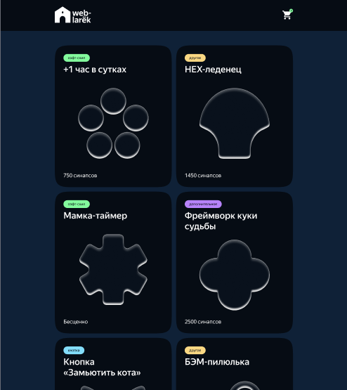
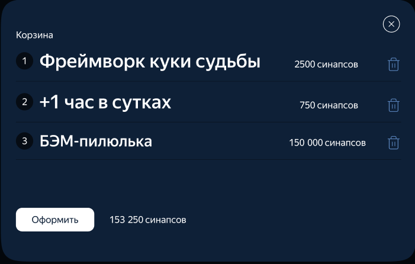
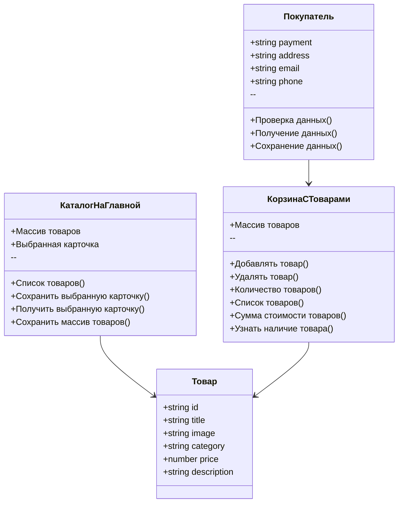
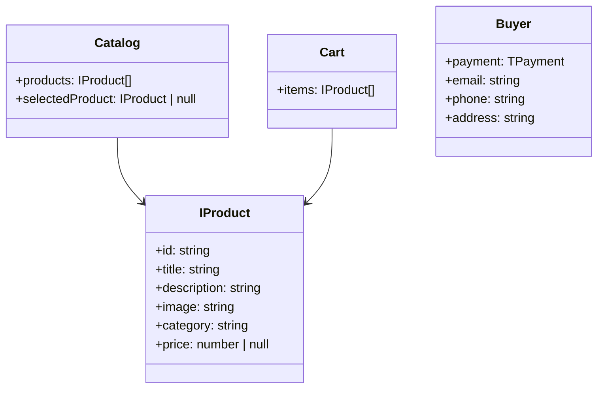

# Проектная работа "Веб-ларек"

Стек: HTML, SCSS, TS, Vite

Структура проекта:
- src/ — исходные файлы проекта
- src/components/ — папка с JS компонентами
- src/components/base/ — папка с базовым кодом

Важные файлы:
- index.html — HTML-файл главной страницы
- src/types/index.ts — файл с типами
- src/main.ts — точка входа приложения
- src/scss/styles.scss — корневой файл стилей
- src/utils/constants.ts — файл с константами
- src/utils/utils.ts — файл с утилитами

## Установка и запуск
Для установки и запуска проекта необходимо выполнить команды

```
npm install
npm run start
```

или

```
yarn
yarn start
```
## Сборка

```
npm run build
```

или

```
yarn build
```
# Интернет-магазин «Web-Larёk»
«Web-Larёk» — это интернет-магазин с товарами для веб-разработчиков, где пользователи могут просматривать товары, добавлять их в корзину и оформлять заказы. Сайт предоставляет удобный интерфейс с модальными окнами для просмотра деталей товаров, управления корзиной и выбора способа оплаты, обеспечивая полный цикл покупки с отправкой заказов на сервер.

## Архитектура приложения

Код приложения разделен на слои согласно парадигме MVP (Model-View-Presenter), которая обеспечивает четкое разделение ответственности между классами слоев Model и View. Каждый слой несет свой смысл и ответственность:

Model - слой данных, отвечает за хранение и изменение данных.  
View - слой представления, отвечает за отображение данных на странице.  
Presenter - презентер содержит основную логику приложения и  отвечает за связь представления и данных.

Взаимодействие между классами обеспечивается использованием событийно-ориентированного подхода. Модели и Представления генерируют события при изменении данных или взаимодействии пользователя с приложением, а Презентер обрабатывает эти события используя методы как Моделей, так и Представлений.

### Базовый код

#### Класс Component
Является базовым классом для всех компонентов интерфейса.
Класс является дженериком и принимает в переменной `T` тип данных, которые могут быть переданы в метод `render` для отображения.

Конструктор:  
`constructor(container: HTMLElement)` - принимает ссылку на DOM элемент за отображение, которого он отвечает.

Поля класса:  
`container: HTMLElement` - поле для хранения корневого DOM элемента компонента.

Методы класса:  
`render(data?: Partial<T>): HTMLElement` - Главный метод класса. Он принимает данные, которые необходимо отобразить в интерфейсе, записывает эти данные в поля класса и возвращает ссылку на DOM-элемент. Предполагается, что в классах, которые будут наследоваться от `Component` будут реализованы сеттеры для полей с данными, которые будут вызываться в момент вызова `render` и записывать данные в необходимые DOM элементы.  
`setImage(element: HTMLImageElement, src: string, alt?: string): void` - утилитарный метод для модификации DOM-элементов ``


#### Класс Api
Содержит в себе базовую логику отправки запросов.

Конструктор:  
`constructor(baseUrl: string, options: RequestInit = {})` - В конструктор передается базовый адрес сервера и опциональный объект с заголовками запросов.

Поля класса:  
`baseUrl: string` - базовый адрес сервера  
`options: RequestInit` - объект с заголовками, которые будут использованы для запросов.

Методы:  
`get(uri: string): Promise<object>` - выполняет GET запрос на переданный в параметрах ендпоинт и возвращает промис с объектом, которым ответил сервер  
`post(uri: string, data: object, method: ApiPostMethods = 'POST'): Promise<object>` - принимает объект с данными, которые будут переданы в JSON в теле запроса, и отправляет эти данные на ендпоинт переданный как параметр при вызове метода. По умолчанию выполняется `POST` запрос, но метод запроса может быть переопределен заданием третьего параметра при вызове.  
`handleResponse(response: Response): Promise<object>` - защищенный метод проверяющий ответ сервера на корректность и возвращающий объект с данными полученный от сервера или отклоненный промис, в случае некорректных данных.

#### Класс EventEmitter
Брокер событий реализует паттерн "Наблюдатель", позволяющий отправлять события и подписываться на события, происходящие в системе. Класс используется для связи слоя данных и представления.

Конструктор класса не принимает параметров.

Поля класса:  
`_events: Map<string | RegExp, Set<Function>>)` -  хранит коллекцию подписок на события. Ключи коллекции - названия событий или регулярное выражение, значения - коллекция функций обработчиков, которые будут вызваны при срабатывании события.

Методы класса:  
`on<T extends object>(event: EventName, callback: (data: T) => void): void` - подписка на событие, принимает название события и функцию обработчик.  
`emit<T extends object>(event: string, data?: T): void` - инициализация события. При вызове события в метод передается название события и объект с данными, который будет использован как аргумент для вызова обработчика.  
`trigger<T extends object>(event: string, context?: Partial<T>): (data: T) => void` - возвращает функцию, при вызове которой инициализируется требуемое в параметрах событие с передачей в него данных из второго параметра.

# Web-Larёk — Интернет-магазин для веб-разработчиков

  

---

## Оглавление

* [Установка и запуск](#установка-и-запуск)
* [Описание проекта](#описание-проекта)
* [Скриншоты](#скриншоты)
* [Документация](#документация)

  * [Структура проекта](#структура-проекта)
  * [Архитектура приложения](#архитектура-приложения)
  * [Классы и их роли](#классы-и-их-роли)
  * [Диаграмма классов](#диаграмма-классов-mermaid)
  * [Данные](#данные)
  * [Интерфейсы данных](#интерфейсы-данных)
  * [Модели данных](#модели-данных)
  * [Диаграмма моделей данных](#диаграмма-моделей-данных-mermaid)
  * [Слой коммуникации](#слой-коммуникации)
  * [Примеры использования](#примеры-использования)

---

## Установка и запуск

```bash
# с npm
npm install
npm run dev       # запуск dev-сервера Vite
npm run build     # сборка проекта

# с yarn
yarn
yarn dev
yarn build
```

---

## Описание проекта

«Web-Larёk» — интернет-магазин с товарами для веб-разработчиков.
Пользователи могут:

* Просматривать каталог товаров и детали каждого товара.
* Добавлять товары в корзину.
* Управлять корзиной и оформлять заказы.
* Выбирать способ оплаты и отправлять заказ на сервер.

Приложение обеспечивает удобный интерфейс с модальными окнами и полным циклом покупки.

---

## Скриншоты





---

## Документация

### Структура проекта

```
src/                — исходные файлы проекта
├─ components/      — JS компоненты
│  └─ base/         — базовый код компонентов
├─ types/index.ts   — типы данных
├─ main.ts          — точка входа приложения
├─ scss/styles.scss — корневой файл стилей
└─ utils/
   ├─ constants.ts  — константы
   └─ utils.ts      — утилиты
index.html           — главная страница
```

### Архитектура приложения

Приложение построено с использованием **MVP-подхода** и событийного взаимодействия между слоями.

### Классы и их роли

| Класс                | Поля                                                       | Методы                                                                                                                         | Описание                                                       |
| -------------------- | ---------------------------------------------------------- | ------------------------------------------------------------------------------------------------------------------------------ | -------------------------------------------------------------- |
| **Товар**            | `id`, `title`, `image`, `category`, `price`, `description` | —                                                                                                                              | Представляет отдельный товар интернет-магазина                 |
| **КаталогНаГлавной** | Массив товаров, выбранная карточка                         | Список товаров(), Сохранить выбранную карточку(), Получить выбранную карточку(), Сохранить массив товаров()                    | Управляет списком товаров на главной странице и выбором товара |
| **КорзинаСТоварами** | Массив товаров                                             | Добавлять товар(), Удалять товар(), Количество товаров(), Список товаров(), Сумма стоимости товаров(), Узнать наличие товара() | Управляет корзиной покупок                                     |
| **Покупатель**       | `payment`, `address`, `email`, `phone`                     | Проверка данных(), Получение данных(), Сохранение данных()                                                                     | Управляет данными пользователя и оформлением заказа            |

### Диаграмма классов mermaid



### Данные

#### Интерфейсы данных

**Товар**

```ts
interface IProduct {
  id: string;
  title: string;
  description: string;
  image: string;
  category: string;
  price: number | null;
}
```

**Покупатель**

```ts
interface IBuyer {
  payment: TPayment;
  email: string;
  phone: string;
  address: string;
}
```

**Объект для отправки заказа**

```ts
interface IOrder {
  buyer: IBuyer;
  items: IProduct[];
}
```

### Модели данных

#### Каталог товаров Catalog

**Конструктор:**

```ts
constructor(products: IProduct[] = [])
```

**Поля:** `products`, `selectedProduct`
**Методы:** `setProducts`, `getProducts`, `getProductById`, `setSelectedProduct`, `getSelectedProduct`

#### Корзина Cart

**Конструктор:**

```ts
constructor(items: IProduct[] = [])
```

**Поля:** `items`
**Методы:** `getItems`, `addItem`, `removeItem`, `clear`, `getTotalPrice`, `getCount`, `hasItem`

#### Покупатель Buyer

**Конструктор:**

```ts
constructor(data?: IBuyer)
```

**Поля:** `payment`, `email`, `phone`, `address`
**Методы:** `setData`, `getData`, `clear`, `validate`

### Диаграмма моделей данных mermaid



### Слой коммуникации

**Класс Communication** — отвечает за получение данных с сервера и отправку данных заказа.

**Конструктор:**

```ts
constructor(api: Api)
```

**Поля:** `api: Api`

**Методы:**

```ts
// Получение всех товаров
getProducts(): Promise<IProduct[]>;

// Отправка заказа
sendOrder(order: IOrder): Promise<object>;
```

**Пример использования:**

```ts
const communication = new Communication(api);
communication.getProducts()
  .then(products => catalog.setProducts(products))
  .catch(err => console.error(err));

const order: IOrder = { buyer: buyer.getData(), items: cart.getItems() };
communication.sendOrder(order)
  .then(response => console.log('Заказ отправлен', response))
  .catch(err => console.error(err));
```

### Примеры использования

```ts
// Подписка на событие
eventEmitter.on('cart:added', (product) => {
    console.log('Товар добавлен в корзину', product);
});

// Вызов API через Communication
communication.getProducts()
   .then(products => console.log(products))
   .catch(err => console.error(err));
```
