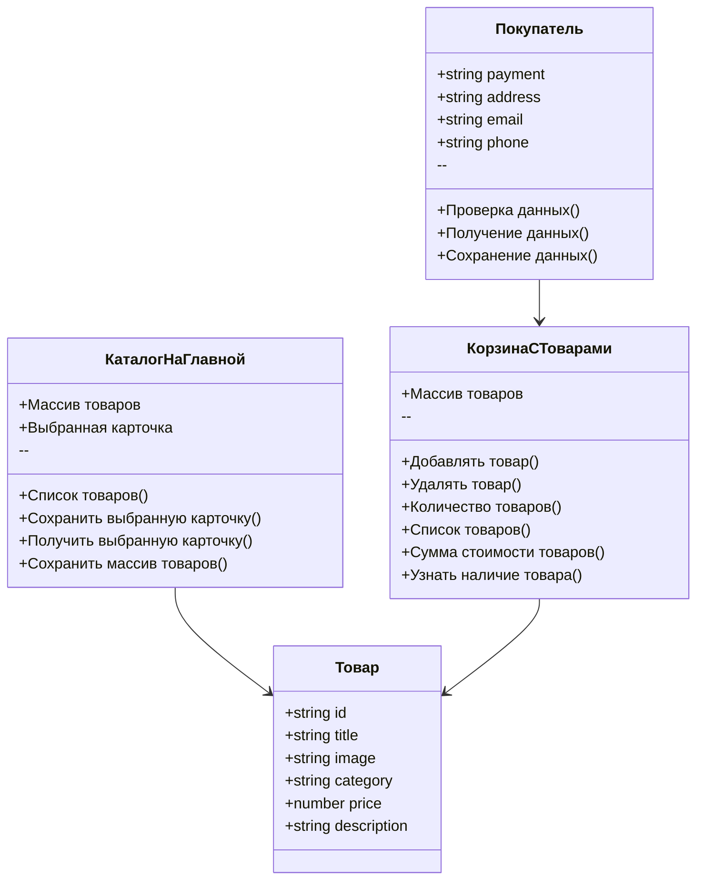
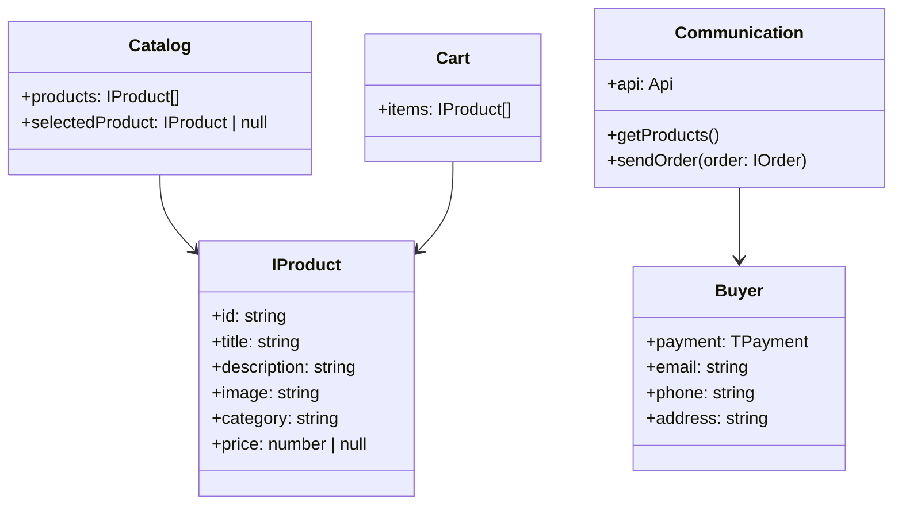
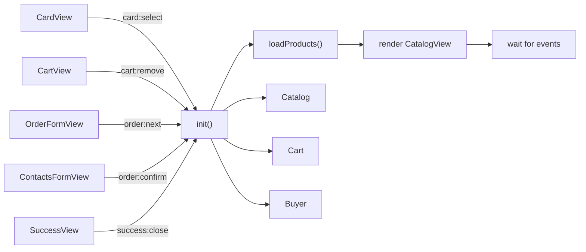

# Web-Larёk — Интернет-магазин для веб-разработчиков

  

---

## Оглавление

* [Установка и запуск](#установка-и-запуск)
* [Описание проекта](#описание-проекта)
* [Скриншоты](#скриншоты)
* [Документация](#документация)
  

  * [Структура проекта](#структура-проекта)
  * [Архитектура приложения](#архитектура-приложения)
  * [Классы и их роли](#классы-и-их-роли)
  * [Диаграмма классов](#диаграмма-классов-mermaid)
  * [Данные](#данные)
  * [Интерфейсы данных](#интерфейсы-данных)
  * [Модели данных](#модели-данных)
  * [Диаграмма моделей данных](#диаграмма-моделей-данных-mermaid)
  * [Слой коммуникации](#слой-коммуникации)
  * [Событийная система](#событийная-система)
  * [Presenter](#presenter)
  * [Views](#views)
  * [Events](#events)
  * [Примеры использования](#примеры-использования)
  * [Автономность моделей данных](#автономность-моделей-данных)

---

## Установка и запуск

```bash
# с npm
npm install
npm run dev       # запуск dev-сервера Vite
npm run build     # сборка проекта

# с yarn
yarn
yarn dev
yarn build
```

---

## Описание проекта

«Web-Larёk» — интернет-магазин с товарами для веб-разработчиков.
Пользователи могут:

* Просматривать каталог товаров и детали каждого товара.
* Добавлять товары в корзину.
* Управлять корзиной и оформлять заказы.
* Выбирать способ оплаты и отправлять заказ на сервер.

Приложение обеспечивает удобный интерфейс с модальными окнами и полным циклом покупки.

---

## Скриншоты

**UI-Kit**  


**Главная страница**  


**Карточка товара**  


**Корзина**  


**Оформление заказа — шаг 1**  


**Оформление заказа — шаг 2**  


---

## Документация

### Структура проекта

```
src/                — исходные файлы проекта
├─ components/      — JS компоненты
│  └─ base/         — базовый код компонентов
├─ types/index.ts   — типы данных
├─ main.ts          — точка входа приложения
├─ scss/styles.scss — корневой файл стилей
└─ utils/
   ├─ constants.ts  — константы
   └─ utils.ts      — утилиты
index.html           — главная страница
```

### Архитектура приложения

Приложение построено с использованием **MVP-подхода** и событийного взаимодействия между слоями.

### Классы и их роли

| Класс                | Поля                                                       | Методы                                                                                                                         | Описание                                                       |
| -------------------- | ---------------------------------------------------------- | ------------------------------------------------------------------------------------------------------------------------------ | -------------------------------------------------------------- |
| **Товар**            | `id`, `title`, `image`, `category`, `price`, `description` | —                                                                                                                              | Представляет отдельный товар интернет-магазина                 |
| **КаталогНаГлавной** | Массив товаров, выбранная карточка                         | Список товаров(), Сохранить выбранную карточку(), Получить выбранную карточку(), Сохранить массив товаров()                    | Управляет списком товаров на главной странице и выбором товара |
| **КорзинаСТоварами** | Массив товаров                                             | Добавлять товар(), Удалять товар(), Количество товаров(), Список товаров(), Сумма стоимости товаров(), Узнать наличие товара() | Управляет корзиной покупок                                     |
| **Покупатель**       | `payment`, `address`, `email`, `phone`                     | Проверка данных(), Получение данных(), Сохранение данных()                                                                     | Управляет данными пользователя и оформлением заказа            |

### Диаграмма классов mermaid



## Данные

### Интерфейсы данных

### Товар IProduct
**Назначение: IProduct** — описывает структуру объекта товара, который хранится в каталоге и корзине. Содержит информацию о названии, цене, изображении, категории и описании товара.
```ts
interface IProduct {
  id: string;       // уникальный идентификатор товара
  title: string;    // название товара
  description: string; // описание товара
  image: string;    // ссылка на изображение товара
  category: string; // категория, к которой относится товар
  price: number | null; // цена товара (null, если цена не указана)
}
```


### Покупатель IBuyer
**Назначение: IBuyer** — описывает данные покупателя, необходимые для оформления заказа (контактные данные и способ оплаты).

```ts
interface IBuyer {
  payment: TPayment; // выбранный способ оплаты
  email: string;     // email покупателя
  phone: string;     // телефон покупателя
  address: string;   // адрес доставки
}
```


### Объект для отправки заказа IOrder
**Назначение: IOrder** — описывает объект заказа, который отправляется на сервер. Содержит информацию о покупателе и товарах, включенных в заказ.
```ts
interface IOrder {
  buyer: IBuyer;     // данные покупателя
  items: IProduct[]; // список выбранных товаров
}
```


## Модели данных

### Class "Каталог товаров" Catalog
**Назначение:** класс управляет массивом всех доступных товаров и выбранным товаром для подробного отображения.

**Конструктор:**

```ts
constructor(products: IProduct[] = [])
```

**Поля:**

* `products: IProduct[]` — массив всех доступных товаров.
* `selectedProduct: IProduct | null` — выбранный товар (например, при просмотре деталей).

**Методы:**

* `setProducts(products: IProduct[]): void` — устанавливает список товаров в каталог.
* `getProducts(): IProduct[]` — возвращает массив товаров.
* `getProductById(id: string): IProduct | undefined` — возвращает товар по `id` или `undefined`, если не найден.
* `setSelectedProduct(product: IProduct): void` — сохраняет выбранный товар.
* `getSelectedProduct(): IProduct | null` — возвращает текущий выбранный товар или `null`, если ничего не выбрано.


### Class "Корзина" Cart
**Назначение:** класс хранит массив товаров, выбранных покупателем, и предоставляет методы для управления корзиной и расчетов.

**Конструктор:**

```ts
constructor(items: IProduct[] = [])
```

**Поля:**

* `items: IProduct[]` — массив товаров, добавленных в корзину.

**Методы:**

* `getItems(): IProduct[]` — возвращает все товары из корзины.
* `addItem(item: IProduct): void` — добавляет товар в корзину.
* `removeItem(id: string): void` — удаляет товар из корзины по `id`.
* `clear(): void` — полностью очищает корзину.
* `getTotalPrice(): number` — вычисляет суммарную стоимость всех товаров.
* `getCount(): number` — возвращает количество товаров в корзине.
* `hasItem(id: string): boolean` — проверяет, есть ли товар в корзине по `id`.


### Class "Покупатель" Buyer
**Назначение:** класс управляет данными покупателя, позволяет сохранять, очищать и проверять введённые данные.

**Конструктор:**

```ts
constructor(data?: IBuyer)
```

**Поля:**

* `payment: TPayment` — выбранный способ оплаты (например, карта или наличные).
* `email: string` — адрес электронной почты покупателя.
* `phone: string` — номер телефона покупателя.
* `address: string` — адрес доставки заказа.

**Методы:**

* `setData(data: IBuyer): void` — обновляет данные покупателя.
* `getData(): IBuyer` — возвращает текущие данные покупателя.
* `clear(): void` — очищает данные (например, после оформления заказа).
* `validate(): boolean` — проверяет корректность введённых данных (например, формат email и телефона).


### Диаграмма моделей данных mermaid



### Слой коммуникации

**Класс Communication** 

**Назначение:** отвечает за получение данных с сервера и отправку данных заказа.

**Конструктор:**

```ts
constructor(api: Api)
```

**Поля:**

* `api: Api` — объект для взаимодействия с сервером

**Методы:**

* `getProducts(): Promise<IProduct[]>` — отправляет запрос на сервер и возвращает список товаров
* `sendOrder(order: IOrder): Promise<object>` — отправляет заказ на сервер и возвращает ответ

**Пример использования:**

```ts
const communication = new Communication(api);
communication.getProducts()
  .then(products => catalog.setProducts(products))
  .catch(err => console.error(err));

const order: IOrder = { buyer: buyer.getData(), items: cart.getItems() };
communication.sendOrder(order)
  .then(response => console.log('Заказ отправлен', response))
  .catch(err => console.error(err));
```

### Примеры использования

```ts
// Подписка на событие
eventEmitter.on('cart:added', (product) => {
    console.log('Товар добавлен в корзину', product);
});

// Вызов API через Communication
communication.getProducts()
   .then(products => console.log(products))
   .catch(err => console.error(err));
```
### Событийная система

В проекте используется единая шина событий на базе `EventEmitter` (`src/components/base/Events.ts`).  
Глобальный экземпляр — `events`.

**API:**
- `events.on(event, handler)` — подписка
- `events.off(event, handler)` — отписка
- `events.emit(event, payload?)` — эмит события
- `events.onAll(handler)` — слушать все события
- `events.offAll()` — снять все подписки
- `events.trigger(event, context?)` — обёртка-коллбек, при вызове эмитит событие

**Пример:**
```ts
import { events } from './components/base/Events';

// подписка
events.on<{ id: string }>('card:select', ({ id }) => {
  // открыть превью товара
});

// эмит
events.emit('cart:add', product);
```
## Presenter

Для организации логики приложения используется отдельный слой Presenter.  
Главный класс — `AppPresenter` (`src/components/Presenter/AppPresenter.ts`).

**Назначение:**Класс **AppPresenter** — это центральный слой приложения, реализующий паттерн **MVP**.  
Он отвечает за инициализацию, загрузку данных, подписку на события и связь между моделями (`Catalog`, `Cart`, `Buyer`) и вьюхами (`CatalogView`, `CartView`, `ProductPreviewView`, формы заказа и успеха), и слой коммуникации (`Communication`). Обеспечивает подписку на события и маршрутизацию данных между слоями.

#### Основные задачи:

1. **Инициализация приложения**  
   - Загружает список товаров с сервера через `Communication`.
   - Передаёт данные в `Catalog` и `CatalogView`.
   - Обновляет счётчик корзины при старте.

2. **Связь между слоями**  
   - Подписывается на события из `Views` через `events.on`.
   - Обновляет модели (`Catalog`, `Cart`, `Buyer`) на основе событий.
   - Управляет состоянием модалки (`ModalView`) для показа карточек, корзины и форм.

3. **Обработка покупок**  
   - Добавление/удаление товаров из корзины.  
   - Переход по шагам оформления заказа (оплата → контакты → подтверждение).  
   - Отправка финального заказа на сервер и показ `SuccessView`.

#### Пример последовательности работы:


**Пример использования:**
```ts
import { AppPresenter } from './components/Presenter/AppPresenter';

const app = new AppPresenter();
app.init();
```
## Views

В проекте реализован отдельный слой представления (View-компоненты), отвечающий за отрисовку интерфейса и генерацию событий.  

#### Основные классы:

- **CardView (`CardView.ts`)**  
  Отвечает за отображение карточки товара в каталоге.  
  Генерирует событие `card:select` при клике.  

- **CatalogView (`CatalogView.ts`)**  
  Контейнер для списка карточек (`CardView`).  
  Используется для отрисовки каталога товаров.  

- **CartView (`CartView.ts`)**  
  Отвечает за отображение корзины: список товаров, общая сумма, кнопка оформления заказа.  
  Генерирует события `cart:remove` (удаление по индексу) и `cart:order` (переход к оформлению).  

- **ProductPreviewView (`ProductPreviewView.ts`)**  
  Используется для отображения модалки с подробной информацией о товаре.  
  Генерирует событие `cart:add` при добавлении товара в корзину.  

- **OrderFormView (`OrderFormView.ts`)**  
  Шаг 1 оформления заказа: выбор способа оплаты и ввод адреса.  
  Генерирует событие `order:next`.  

- **ContactsFormView (`ContactsFormView.ts`)**  
  Шаг 2 оформления заказа: ввод email и телефона.  
  Генерирует событие `order:confirm`.  

- **ModalView (`ModalView.ts`)**  
  Универсальный контроллер модальных окон.  
  Управляет показом/скрытием, блокировкой скролла, генерирует события `modal:open` и `modal:close`.  

- **SuccessView (`SuccessView.ts`)**  
  Показывает результат успешного оформления заказа.  
  Генерирует событие `success:close`.  

---

## Events

Для событийного взаимодействия между слоями приложения используется собственная реализация брокера событий `EventEmitter` (файл `Events.ts`).  
Это позволяет максимально изолировать модули друг от друга и реализовать архитектуру в стиле **Publisher–Subscriber**.

#### Основные возможности:

- **on(event, callback)** — подписка на событие.  
- **off(event, callback)** — отписка от события.  
- **emit(event, data?)** — инициирует событие с переданными данными.  
- **onAll(callback)** — подписка на все события сразу.  
- **offAll()** — сброс всех подписчиков.  
- **trigger(event, context?)** — вспомогательный метод, создающий callback для автоматической генерации событий.  

#### Примеры использования:

```ts
// Подписка на добавление товара
events.on<IProduct>('cart:add', (product) => {
  console.log('Товар добавлен в корзину:', product.title);
});

// Генерация события
events.emit('cart:add', someProduct);

// Подписка на все события
events.onAll(({ eventName, data }) => {
  console.log('Событие:', eventName, 'Данные:', data);
});
```
### Роль в приложении:

**Views** (например, CardView, CartView, OrderFormView) генерируют события через events.emit.

**AppPresenter** подписывается на эти события через events.on и управляет моделями (Catalog, Cart, Buyer).

Таким образом достигается слабая связанность: слои не знают друг о друге напрямую, а общаются только через событийный канал.

### Автономность моделей данных

```mermaid
flowchart TB
    subgraph Models [Модели данных]
        Catalog["Catalog - Товары"]
        Cart["Cart - Корзина"]
        Buyer["Buyer - Покупатель"]
    end

    subgraph UI [Интерфейс / Вёрстка]
        View["View / Components"]
    end

    subgraph Communication [Слой коммуникации]
        API["API / Communication"]
    end

    %% Взаимодействия
    View -->|использует методы| Catalog
    View -->|использует методы| Cart
    View -->|использует методы| Buyer

    API -->|получает данные и передаёт| Catalog
    API -->|получает данные и передаёт| Cart
    API -->|получает данные и передаёт| Buyer

    %% Модели данных автономны
    Catalog -.->|не зависит от| View
    Cart -.->|не зависит от| View
    Buyer -.->|не зависит от| View

    Catalog -.->|не зависит от| API
    Cart -.->|не зависит от| API
    Buyer -.->|не зависит от| API
